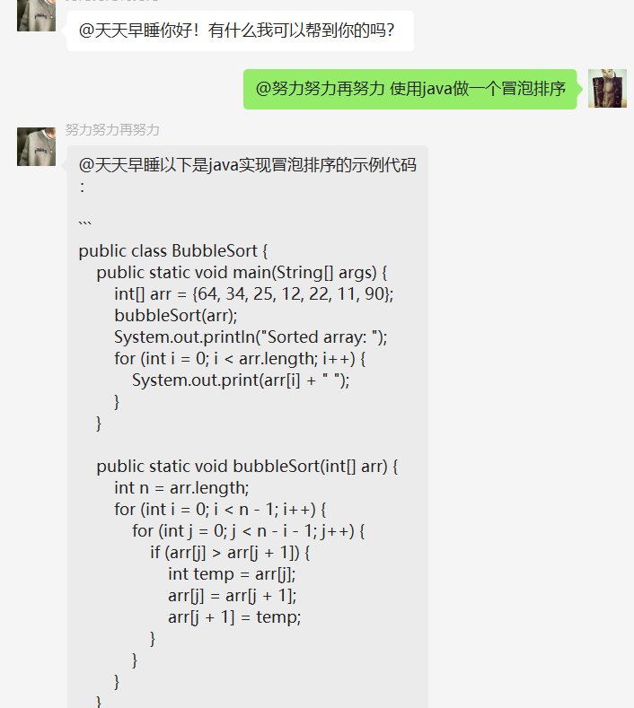
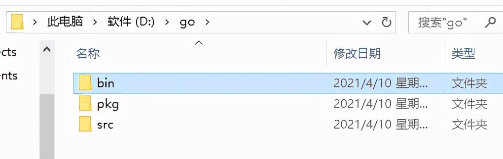
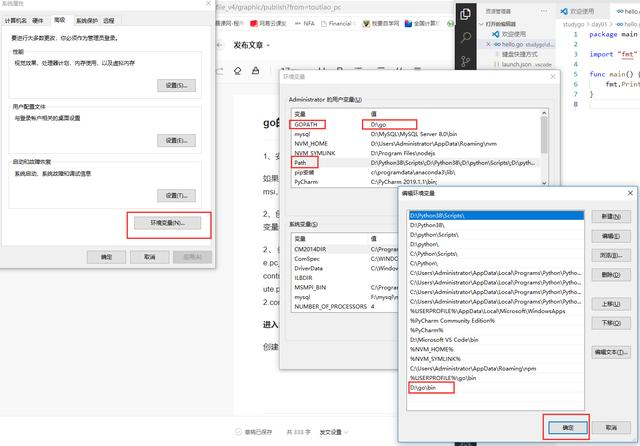
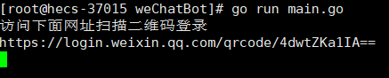

# ChatGPT-MidJourney-WeChatbot
参考项目:https://github.com/djun/wechatbot


## 项目介绍
使用在微信群中使用ChatGPT-MidJourney微信机器人,使用效果如下图所示:




## 项目体验

| QQ频道                                                          | 微信公众号                                                              |                                微信号                                 |
|:--------------------------------------------------------------|:-------------------------------------------------------------------|:------------------------------------------------------------------:|
|  |  |  |


## MidJourney服务接入

### 参考下面的步骤接入MidJourney服务
https://github.com/l269438/Midjourney-api
#### 接入后 切换当前项目的laf分支

## 使用介绍
1.使用MidJourney 生成图片需要@我们的机器人 + mj +咒语,例如:
```
 @bot mj Cool shaped mecha, holding double swords, future robot concept design, strong limbs, exaggerated and powerful fighting movements, three-quarter composition, 3D, 3D modeling, texture rendering, CG concept, perfect body light, mainly in black and blue tones, art station, future cool, solid background
```
2.使用MidJourney 扩展图片需要@我们的机器人 + ex + 唯一标识符+,+V/U[1-4]例如:

```
 @bot ex 354557567567,U3
```
3.使用ChatGPT 聊天需要@我们的机器人 +内容,例如:
```
 @bot 使用java完成冒泡排序
```

## 快速开始

### 1.安装go环境
使用go 1.16.2版本,安装go环境
### 2.配置环境变量
找到go的安装目录,将bin目录添加到环境变量中


### 3.检测go环境
在命令行中输入```go version```,如果出现go的版本信息,则说明go环境配置成功
### 4.安装依赖
进入命令提示符下，输入 ```go env -w GOPROXY=https: //goproxy.io,direct```
在项目根目录下,执行```go mod tidy```,安装依赖

### 5.配置环境-进入文件目录：复制config.dev.json 为config.json,并修改其中的配置信息
```json
{
  // ChatGPT的api的key
  "api_key": "",
  // 是否开启自动通过好友请求
  "auto_pass": true,
  // 请求chatgpt的url
  "chat_url": "",
  // 请求midjourney的生成图片的url 
  "mj_img_url": "",
  // 请求midjourney的扩展图片的url
  "mj_ex_url": "",
  // midjourney生成图后回调的url
  "webhook":""
}
```
```
注：
1.如果不需要使用midjourney的功能，可以不配置mj_img_url,mj_ex_url,webhook
2.api_key获取方式请参考:https://platform.openai.com/overview
3.chat_url默认为https://api.openai.com/ 被墙的话可以使用代理
4.mj_img_url,mj_ex_url为midjourney的url,需要自己搭建midjourney服务 搭建https://github.com/l269438/Midjourney-api
5.webhook为midjourney生成图后回调的url 需要填当前服务器的ip+端口+/mj/v3/webhook。例如: http://127.0.0.1:9095/mj/v3/webhook
```

## 运行
>在windows下,Goland中运行main.go即可
>
>或在项目根目录下,执行```go run main.go```

>在linux下,在项目根目录下,执行```go build main.go```生成可执行文件,然后执行```./main```
>
> 或在项目根目录下,执行```go run main.go```

最后复制网址到浏览器中打开,扫码登录即可


注：
在liunx下希望后台运行,可以使用nohup命令,例如:
```
nohup ./main &
或
nohup go run main.go &
```

